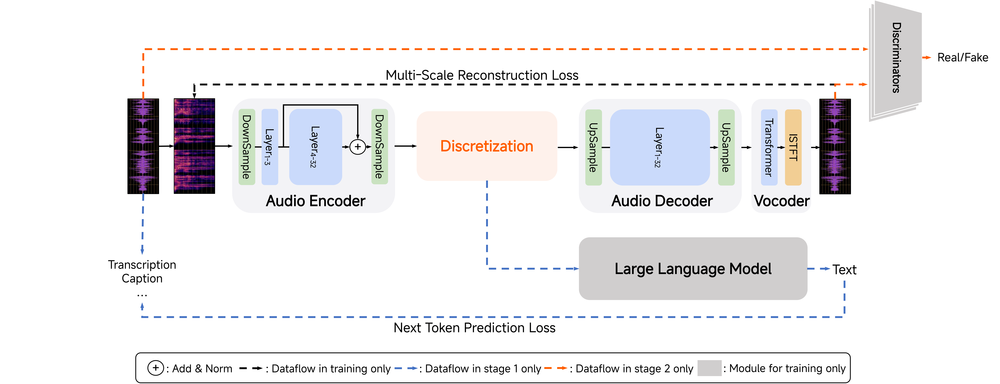

<div align="center">


# MiMo-Audio-Tokenizer



<p><em>A unified tokenizer that is capable of both extracting semantic information and enabling high-fidelity audio reconstruction.</em></p>

</div>

## Key Features

- Scaled parameters and training data bootstrap the frontier of audio tokenization
  - 1.2B pure transformer-based architecture to keep both efficiency and effectiveness
  - trained from scratch over 11 million hours covering both audio reconstruction task and the audio-to-text (A2T) task

- Unified representation enhance both cross-modal alignment and speech reconstruction quality
  - jointly capture both semantic and acoustic information while further alleviates the semantic-acoustic representation conflict

## Installation

```sh
git clone https://github.com/XiaomiMiMo/MiMo-Audio-Tokenizer
cd MiMo-Audio-Tokenizer
# Install base dependencies
pip install -e .
# Install flash-attn
pip install -e ".[flash]"
```

## Model Download

```sh
# you might need `sudo apt-get install git-lfs` before download this model
git clone https://huggingface.co/XiaomiMiMo/MiMo-Audio-Tokenizer
```

## Example Usage

### 0. Quick start

```py
import torchaudio
import mimo_audio_tokenizer

# one-line model init
tokenizer = mimo_audio_tokenizer.load_model("path to your model").bfloat16().cuda()  # FlashAttention only support fp16 and bf16 data type

# preprocess
mels = []
wav_paths = ["mimo_audio_tokenizer/assets/BAC009S0764W0121.wav", "mimo_audio_tokenizer/assets/BAC009S0764W0122.wav", "mimo_audio_tokenizer/assets/猪八戒_gt.wav"]
for wav_path in wav_paths:
    wav = mimo_audio_tokenizer.load_audio(wav_path, tokenizer.config.sampling_rate)
    mels.append(mimo_audio_tokenizer.mel_spectrogram(wav, tokenizer.config))
mels, mels_lens = mimo_audio_tokenizer.padding(mels)  # (batch_size, n_mels, seq_len), (batch_size,)

# one-line encode
codes, codes_lens, _ = tokenizer.encode(mels.cuda(), mels_lens.cuda())  # (batch_size, max_len, num_quantizers), (batch_size,)

# one-line decode
wavs, wavs_lens, _ = tokenizer.decode(codes, codes_lens)  # (batch_size, 1, wav_len)

# inspect results
for i in range(len(wav_paths)):
    print(codes[i, :codes_lens[i].item()])

for i in range(len(wav_paths)):
    torchaudio.save(f"{i}.wav", wavs[i, :, :wavs_lens[i].item()].float().cpu().detach(),
                    tokenizer.config.sampling_rate, format='wav', encoding='PCM_S')

```

### 1. Distributed offline batch inference via command-line tools

`mimo_audio_tokenizer` is built for distributed offline batch inference.

```sh
# 1 node 8 gpu, try to decrease `batch_size` if OOM
# task choices:
#   "wav2token": need `key` / `wav` / `quantized_tokens` available in data.jsonl
#   "token2wav": need `key` / `quantized_tokens` / `reconstructed_wav` available in data.jsonl
#   "wav2token2wav": need `key` / `wav` / `quantized_tokens` / `reconstructed_wav` available in data.jsonl
torchrun --nproc_per_node=8 --nnodes=1 \
     --rdzv_id=2025 --rdzv_backend="c10d" --rdzv_endpoint="localhost:0" \
    `which mimo_audio_tokenizer` \
        --model_path "path to your model" \
        --data_list "path to your data.jsonl" \
        --batch_size 64 \
        --num_workers 8 \
        --prefetch 16 \
        --num_quantizers 20 \
        --task "wav2token2wav"
```

### Example Data Format

Here is example `data.jsonl`:

```json
{"key": "uttid_1", "wav": "/mnt/data/audio/uttid_1.wav", "quantized_tokens": "/mnt/data/audio_reconstructed/uttid_1.json", "reconstructed_wav": "/mnt/data/audio_reconstructed/uttid_1.wav"}
...
{"key": "uttid_2", "wav": "/mnt/data/audio/uttid_2.wav", "quantized_tokens": "/mnt/data/audio_reconstructed/uttid_2.json", "reconstructed_wav": "/mnt/data/audio_reconstructed/uttid_2.wav"}
...
```

- `key` is the key of this sample.
- `wav` is the original audio.
- `quantized_tokens` is the json path to save quantized tokens (we highly recommend to pre-define the save path before running the script).
- `reconstructed_wav` is the wav path to save reconstructed result (we highly recommend to pre-define the save path before running the script).

### 2. Online speech code extraction

`mimo_audio_tokenizer` can also be used in online code extraction to power the training of AudioLLM.

<table>
<tr>
<th>Before (extract code offline)</th>
<th>After (extract code online)</th>
</tr>
<tr>
<td>
<sub>

```py

class AudioLLM(nn.Module):
    ...
    def __init__(self, ...):
        ...

    def forward(self, speech_codes: Tensor, text_ids: Tensor, ...):
        ...
```

</sub>
<td>
<sub>

```py
import mimo_audio_tokenizer

class AudioLLM(nn.Module):
    ...
    def __init__(self, ...):
        ...
        self.audio_tokenizer = mimo_audio_tokenizer.load_model("path to your model")
        self.audio_tokenizer.freeze()  # no need for gradient calculation
        ...

    def forward(self, speech: Tensor, speech_lens: Tensor, text_ids: Tensor, ...):
        ...
        speech_codes, speech_codes_lens = self.audio_tokenizer.encode(speech, speech_lens)
        speech_codes = speech_codes.clone()  # for backward compatbility, stop gradient here
        speech_codes_lens = speeech_codes_lens.clone()  # for backward compatbility, stop gradient here
        ...
```

</sub>
</td>
</tr>
</table>

## Performance Benchmark

|  Method  | RTF | Results on [Seed-TTS-Eval](https://github.com/BytedanceSpeech/seed-tts-eval) (PESQ-NB/PESQ-WB/SpkSim/STOI) |
|:------:|:--------------:|:--------------:|
|  mimo_audio_tokenizer (bs=64, n_q=20)  |   0.0028 (encode+decode)   | (zh) 3.81 / 3.38 / 0.93 / 0.94 |
|                                        |                            | (en) 3.59 / 3.10 / 0.95 / 0.94 |
|  mimo_audio_tokenizer (bs=64, n_q=8)   |   0.0028 (encode+decode)   | (zh) 3.44 / 2.93 / 0.91 / 0.92 |
|                                        |                            | (en) 3.12 / 2.60 / 0.93 / 0.93 |

Test Configuration

- Hardware: 1 * H800 (80GB)
- Total Requests: 1676 ([zh 1010, en 666])
- Note: When testing mimo_audio_tokenizer, we repeated the request 10000 times to obtain a more accurate RTF.

## Citation

```bibtex
@misc{coreteam2025mimoaudio,
      title={MiMo-Audio: Audio Language Models are Few-Shot Learners},
      author={LLM-Core-Team Xiaomi},
      year={2025},
      url={https://github.com/XiaomiMiMo/MiMo-Audio},
}
```

## Contact

Please contact us at [mimo@xiaomi.com](mailto:mimo@xiaomi.com) or open an issue if you have any questions.
